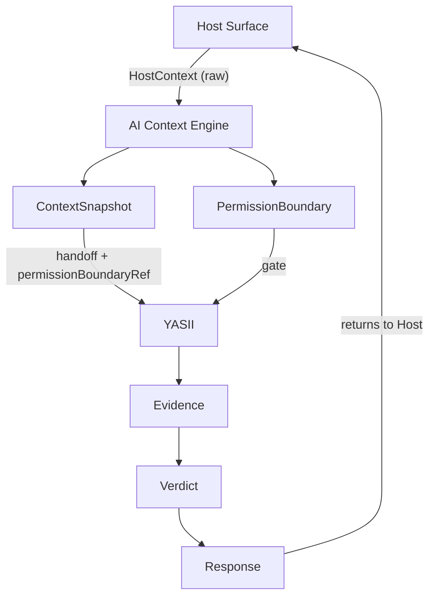

# ADR. Граница AI Context Engine и YASII

## Статус

**ARCHITECTURE DECISION RECORD**

## Дата

2026-05-30

## Связанные документы

- [YASII_CONSTITUTION.md](./YASII_CONSTITUTION.md)
- [YASII_DOMAIN_MODEL.md](./YASII_DOMAIN_MODEL.md) v1.3
- [YASII_SYSTEM_MAP.md](./YASII_SYSTEM_MAP.md)
- [YASNOPRO_AI_CONTEXT_MODEL.md](./YASNOPRO_AI_CONTEXT_MODEL.md)

---

## 1. Проблема

В платформе ЯсноПро одновременно существуют два архитектурных понятия:

```text
AI Context Engine
```

и

```text
YASII (ЯСИИ)
```

Оба связаны с «пониманием компании» и «контекстом для AI», но **граница ответственности между ними не была зафиксирована**.

### Риск

Без явного ADR разработчики могут:

- **дублировать функциональность** — два модуля собирают одни и те же данные с Host Surfaces;
- **хранить контекст в двух местах** — platform context store и YASII-internal context;
- **строить два графа** — platform semantic graph и YASII Knowledge Graph без единого входа;
- **создавать два источника истины** — Host → ACE и Host → YASII параллельно.

Это особенно опасно после утверждения **ContextSnapshot** как центральной сущности запроса в [YASII_DOMAIN_MODEL.md](./YASII_DOMAIN_MODEL.md): без владельца сущности неясно, кто её формирует, кто потребляет и кто отвечает за audit trail.

### Основной вопрос ADR

```text
Где заканчивается AI Context Engine
и начинается YASII?
```

**Ограничение этого документа:** зафиксировать архитектурную ответственность компонентов.  
**Не входит в scope:** проектирование кода, API, схем БД, конкретных модулей или DTO.

---

## 2. Рассматриваемые варианты

### Вариант A — AI Context Engine = часть YASII

**Суть:** AI Context Engine — подсистема внутри YASII Core; сбор контекста, reasoning и Response — единый контур одного продукта.

| | |
|---|---|
| **Плюсы** | Один «владелец» в org-chart; проще объяснить product story «всё AI — это YASII»; меньше межкомпонентных контрактов на старте MVP. |
| **Минусы** | Platform semantic layer оказывается **заперт внутри YASII**; другие AI-потребители (automation, future agents) вынуждены идти через YASII или дублировать сбор; Host Surfaces получают двусмысленность «platform context vs YASII context»; нарушается разделение **инфраструктуры платформы** и **role-driven intelligence**. |
| **Причины отклонения** | AI Context Engine по [YASNOPRO_AI_CONTEXT_MODEL.md](./YASNOPRO_AI_CONTEXT_MODEL.md) — **слой понимания всей платформы**, а не только ЯСИИ. Поглощение ACE в YASII создаёт риск второго контура контекста для non-YASII сценариев и смешивает **сбор данных** с **принятием решений**. |

---

### Вариант B — YASII = часть AI Context Engine

**Суть:** YASII — один из «reasoning adapters» внутри AI Context Engine; Verdict и Response — capabilities платформенного AI-слоя.

| | |
|---|---|
| **Плюсы** | Единая точка входа для всех Host Surfaces; один pipeline «context → answer»; проще централизовать platform-wide AI governance. |
| **Минусы** | YASII теряет статус **нормативного intelligence layer** с Constitution, Domain Model, Roles, Evidence, Verdict; ACE начинает «принимать решения» под видом reasoning; Knowledge Graph, Rule, Citation, Audit YASII становятся неявными деталями platform AI; противоречит [YASII_CONSTITUTION.md](./YASII_CONSTITUTION.md) (единый Core, role-driven execution). |
| **Причины отклонения** | YASII — **операционализация intelligence с Verdict/Evidence/Audit**, а не generic platform AI wrapper. Слияние размывает границу «инфраструктура не решает» vs «YASII решает». |

---

### Вариант C — AI Context Engine и YASII — разные компоненты *(принят)*

**Суть:** два компонента с **жёсткой границей** и единственным нормативным handoff — **ContextSnapshot** (+ **PermissionBoundary** как обязательный gate перед YASII).

| | |
|---|---|
| **Плюсы** | Один источник истины для сбора контекста; YASII остаётся normative reasoning layer; ACE переиспользуем для future AI consumers; чёткие инварианты и audit ownership; согласуется с Domain Model (ContextSnapshot как вход Request) без дублирования графов на уровне Host. |
| **Минусы** | Требуется явный integration contract (Host → ACE → YASII); две команды/модуля должны согласовать версии ContextSnapshot; нужна дисциплина «Host не обходит ACE». |
| **Причины выбора** | Единственный вариант, который одновременно сохраняет **platform AI-native foundation** и **YASII как Constitution-governed intelligence**, не создавая dual SoT для контекста. |

---

## 3. Принятое решение

```text
AI Context Engine
=
платформенный инфраструктурный слой
```

```text
YASII
=
нормативный intelligence layer платформы
(role-driven reasoning, Evidence, Verdict, Response)
```

### AI Context Engine отвечает за

- **сбор контекста** с Host Surfaces и platform sources;
- **нормализацию контекста** в доменные структуры платформы;
- **проверку доступности контекста** (completeness, freshness, referential integrity — на уровне ответственности, не реализации);
- **формирование PermissionBoundary** per request (Host Surface **никогда** не поставляет boundary);
- **формирование ContextSnapshot** (immutable, с `permissionBoundaryRef`);
- **передачу ContextSnapshot** потребителям (в первую очередь — YASII).

### YASII отвечает за

- **интерпретацию контекста** (не сбор);
- **поиск знаний** (Knowledge Domains);
- **работу с графом** (Knowledge Graph, GraphTraversal **внутри** PermissionBoundary);
- **анализ** (reasoning pipeline);
- **формирование Evidence**;
- **формирование Verdict**;
- **формирование Recommendation**;
- **построение Response** (normative / FailureResponse).

### Ключевые запреты решения

```text
AI Context Engine никогда не принимает решений.
```

```text
YASII никогда не собирает контекст напрямую.
```

---

## 4. Граница ответственности

### Pipeline (нормативный)

```text
Host Surface
        ↓
AI Context Engine          ← сбор, нормализация, PermissionBoundary
        ↓
ContextSnapshot            ← immutable handoff (с permissionBoundaryRef)
        ↓
PermissionBoundary         ← gate перед reasoning (owner: ACE)
        ↓
YASII                      ← interpretation, Knowledge, Graph, analysis
        ↓
Evidence
        ↓
Verdict
        ↓
Response
```

> **Примечание о порядке:** семантически PermissionBoundary вычисляется в контуре AI Context Engine **до** входа YASII в Knowledge/Graph. ContextSnapshot **ссылается** на уже вычисленный PermissionBoundary через `permissionBoundaryRef` (см. Domain Model v1.3). YASII **получает** готовую пару, а не вычисляет boundary как часть reasoning. **EffectiveScope** вычисляется **YASII Runtime Entry** после handoff ([Permission Model](./YASII_PERMISSION_MODEL.md) §13).

### Диаграмма ответственности



### Разделение «кто что делает»

| Зона | AI Context Engine | YASII |
|------|-------------------|-------|
| Понимание **где** пользователь и **что** выделено | ● | ○ consumes |
| Понимание **что означает** для бизнеса / compliance | ○ | ● |
| Knowledge retrieval | ○ | ● |
| Graph traversal | ○ | ● (within PB) |
| Verdict / Recommendation | ✗ | ● |
| Audit snapshots of decision | ○ context PB | ● Evidence, Verdict, Response |

---

## 5. Владение сущностями

| Сущность | Owner | Комментарий |
|----------|-------|-------------|
| **HostContext** (raw payload) | Host Surface → ACE | Host поставляет сырой контекст; ACE нормализует |
| **HostSurface** | Host Surface (identity) / ACE (capture in snapshot) | Метаданные surface фиксируются в ContextSnapshot |
| **ContextReference** | AI Context Engine | Элементы ContextSnapshot |
| **ContextSnapshot** | **AI Context Engine** | Центральный handoff; **не принадлежит YASII** |
| **PermissionBoundary** | **AI Context Engine** | Per-request gate; Host never supplies |
| **Request** | YASII (runtime envelope) | ACE не формирует normative Request/Response contract |
| **Knowledge / Knowledge Graph** | YASII | ACE не работает с Knowledge Graph |
| **GraphTraversal / GraphSubgraph** | YASII | Только после PermissionBoundary |
| **Evidence** | YASII | |
| **Rule** | YASII | |
| **Citation** | YASII | |
| **Verdict** | YASII | |
| **Recommendation** | YASII | |
| **Response** / **FailureResponse** | YASII | |
| **RequestSnapshot** | YASII Audit | Freeze Request envelope |
| **ContextSnapshotSnapshot** | YASII Audit | Freeze **ACE-owned** ContextSnapshot |
| **PermissionBoundarySnapshot** | YASII Audit | Freeze **ACE-owned** PermissionBoundary |
| **EvidenceSnapshot / DecisionSnapshot** | YASII Audit | Freeze reasoning artifacts |

---

## 6. Взаимодействие с Host Surfaces

Все Host Surfaces платформы работают **только через AI Context Engine**.  
**Ни один Host Surface не обращается напрямую к YASII.**

| Host Surface | Роль Host | Контур |
|--------------|-----------|--------|
| **Dashboard** | Owner / Platform Development context | Host → ACE → YASII → Response |
| **Designer** | Schema, publish, normative design context | Host → ACE → YASII → Response |
| **Registry** | List / filter / selection context | Host → ACE → YASII → Response |
| **Object Card** | Single entity runtime context | Host → ACE → YASII → Response |
| **Document** | Document-bound context | Host → ACE → YASII → Response |
| **Process** | Workflow / step context | Host → ACE → YASII → Response |

### Обязательства Host Surface

- поставить **HostContext** (raw) в ACE;
- **не** формировать PermissionBoundary;
- **не** вызывать YASII API напрямую;
- отображать **Response** от YASII, полученный через platform integration layer (детали — в будущем Host Integration Contract).

### Запрещено для Host Surfaces

- parallel context pipeline в обход ACE;
- передача «authoritative permissions» в YASII;
- embedding YASII SDK с прямым доступом к Knowledge Graph.

---

## 7. Взаимодействие с Domain Model

| Документ | Роль |
|----------|------|
| [YASII_DOMAIN_MODEL.md](./YASII_DOMAIN_MODEL.md) v1.3 | **Семантика** сущностей, связи, инварианты, audit shapes — **согласовано** с настоящим ADR |
| **ADR_YASII_AI_CONTEXT_BOUNDARY.md** (этот документ) | **Организационная и runtime-граница** между ACE и YASII |

### Согласование (v1.3)

```text
ContextSnapshot не принадлежит YASII.
```

```text
YASII получает ContextSnapshot как вход.
```

```text
PermissionBoundary вычисляется AI Context Engine.
YASII не пересчитывает boundary и не принимает boundary от Host.
```

Domain Model v1.3 описывает ContextSnapshot как центральную сущность **запроса к YASII** и фиксирует **runtime owner formation** для ContextSnapshot и PermissionBoundary — **AI Context Engine**. **EffectiveScope** — **YASII Runtime Entry** после ACE handoff. Семантика Permission First (boundary до Knowledge/Graph) сохраняется.

При расхождении терминов ownership приоритет:

1. этот ADR;
2. YASII Constitution;
3. YASII Domain Model.

---

## 8. Инварианты

Минимальный normative set:

1. **YASII не собирает контекст** — ни с Host Surface, ни с platform APIs напрямую.
2. **Host Surface не формирует PermissionBoundary.**
3. **AI Context Engine не формирует Verdict.**
4. **AI Context Engine не формирует Recommendation.**
5. **AI Context Engine не работает с Knowledge Graph.**
6. **YASII получает только нормализованный ContextSnapshot** (с valid `permissionBoundaryRef`).
7. **Все решения принимаются только YASII** (Verdict, normative Response).
8. **Host Surface не обращается к YASII напрямую.**
9. **ContextSnapshot immutable** после handoff от ACE.
10. **Единственный platform entry для context collection — AI Context Engine.**

---

## 9. Последствия решения

### Что становится проще

- **Один контур сбора контекста** для всех Host Surfaces и будущих AI consumers.
- **Ясное разделение** infra vs intelligence при code review и Dashboard work items.
- **Audit clarity:** ACE-owned snapshots vs YASII-owned decision snapshots.
- **MVP scope:** Phase 1 может начать с ACE handoff contract без duplicate context modules в YASII.

### Что становится сложнее

- Нужны **явные контракты** между ACE и YASII (версионирование ContextSnapshot).
- **Две зоны ответственности** требуют coordination в Roadmap и Analyzer checks.
- Domain Model v1.3 синхронизирован с ADR (ownership PermissionBoundary, ContextSnapshot; EffectiveScope at YASII entry).

### Запрещено делать в будущем

- модуль `yasii/context_collector` или аналог, обходящий ACE;
- Host Surface plugin с direct YASII Runtime call;
- duplicate ContextSnapshot store внутри YASII Memory;
- ACE endpoint, возвращающий Verdict или Recommendation;
- YASII, читающий raw HostContext без ContextSnapshot;
- второй Knowledge Graph «для platform AI» внутри ACE.

---

## 10. Связь с будущими документами

Этот ADR — **основание** для:

| Документ | Scope |
|----------|-------|
| [YASII_HOST_INTEGRATION_CONTRACT.md](./YASII_HOST_INTEGRATION_CONTRACT.md) | HostContext → ACE; Surface Profiles; integration errors |
| [YASII_PERMISSION_MODEL.md](./YASII_PERMISSION_MODEL.md) | Permission Resolution, layers, Effective Scope, audit snapshots |
| [YASII_EVIDENCE_SNAPSHOT_SPEC.md](./YASII_EVIDENCE_SNAPSHOT_SPEC.md) *(planned)* | EvidenceSnapshot, Citation, Rule freeze shapes |

Без принятия этой границы указанные документы рискуют **дублировать** context и permission logic.

---

## Краткая фиксация решения

| Вопрос | Ответ |
|--------|-------|
| Принятое решение | **Вариант C** — ACE и YASII разные компоненты |
| ContextSnapshot owner | **AI Context Engine** |
| PermissionBoundary owner | **AI Context Engine** |
| Граница | ACE заканчивается на **ContextSnapshot + PermissionBoundary handoff**; YASII начинается с **interpretation → Knowledge → Evidence → Verdict → Response** |
