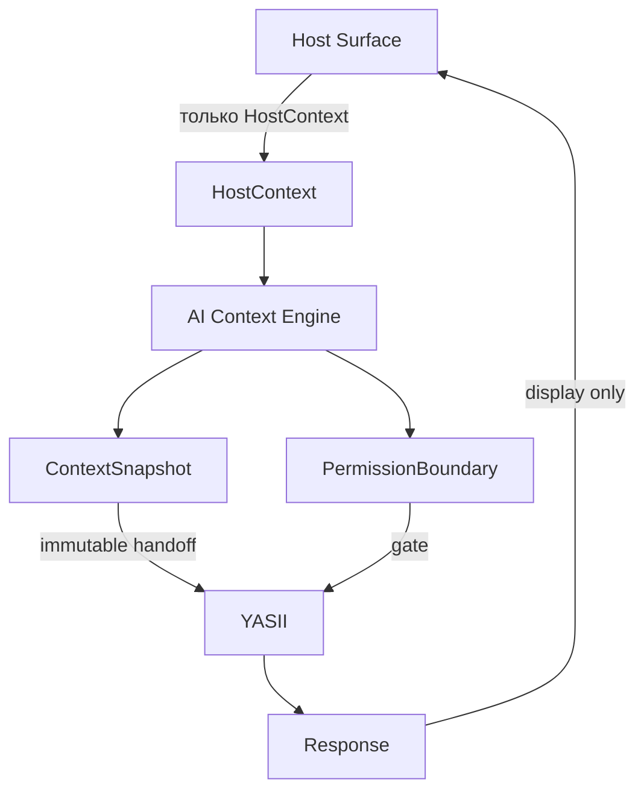

# YASII Host Integration Contract

**Статус:** FOUNDATIONAL INTEGRATION ARCHITECTURE DOCUMENT  
**Версия:** 1.0  
**Дата:** 2026-05-30  

**Базис:** [YASII_CONSTITUTION.md](./YASII_CONSTITUTION.md) · [YASII_DOMAIN_MODEL.md](./YASII_DOMAIN_MODEL.md) v1.3 · [ADR_YASII_AI_CONTEXT_BOUNDARY.md](./ADR_YASII_AI_CONTEXT_BOUNDARY.md) · [YASII_SYSTEM_MAP.md](./YASII_SYSTEM_MAP.md)

**Область:** архитектурный контракт между **Host Surface** и **AI Context Engine** (ACE).  
**Вне области:** REST API, WebSocket, DTO/JSON schema, код модулей, UI-компоненты.

---

# Раздел 1. Назначение документа

## Что такое Host Integration Contract

**Host Integration Contract** — нормативное описание того, **что каждая точка входа платформы обязана передать** в AI Context Engine, **как ACE нормализует** вход в `ContextSnapshot` и `PermissionBoundary`, и **что Host Surface запрещено** делать.

Контракт не задаёт транспорт (HTTP, events, in-process calls). Он задаёт **семантику интеграции** и **единый словарь контекста** для всех Host Surfaces.

## Какие проблемы решает

| Проблема | Решение контракта |
|----------|-------------------|
| Dashboard, Designer, Registry передают разные форматы | Единая сущность **HostContext** + **Surface Profiles** |
| Host формирует ContextSnapshot или permissions | Явный запрет; только ACE строит snapshot и boundary |
| YASII получает сырой UI-state | YASII получает **только** нормализованный ContextSnapshot |
| Неясно, какие capabilities доступны на surface | **Host Capability Matrix** |
| Ошибки контекста «чинятся» в reasoning | Типизированные integration errors; YASII не исправляет Host Context |

## Документы, обязанные соблюдать контракт

| Документ | Обязательство |
|----------|---------------|
| **YASII_CONSTITUTION.md** | Embedded Intelligence; no standalone chat; Permission First |
| **YASII_DOMAIN_MODEL.md** v1.3 | Сущности HostContext, ContextSnapshot, PermissionBoundary, EffectiveScope, Request, Response |
| **ADR_YASII_AI_CONTEXT_BOUNDARY.md** | ACE ownership; Host → ACE → YASII; no direct YASII |
| **YASII_SYSTEM_MAP.md** | Host surfaces, roles, MVP integration scope |
| **YASII_IMPLEMENTATION_ROADMAP.md** | Phase 1 Host Integration spec; ACE work items |
| **Реализация Host UI** | Передаёт только HostContext; не ContextSnapshot |
| **Реализация AI Context Engine** | Нормализация, PermissionBoundary, ContextSnapshot |
| **Реализация YASII** | Entry только через ContextSnapshot handoff |

---

# Раздел 2. Host Surface Model

## Официальные Host Surfaces MVP

```text
Dashboard
Designer
Registry
Object Card
Document
Process
```

Каждая surface — **нормативная точка встраивания** ЯСИИ через ACE. Новая surface требует ADR и расширения Surface Profile.

## Реестр surfaces

| Host Surface | `hostSurface` key (normative) | Назначение | Тип взаимодействия | Тип контекста |
|--------------|--------------------------------|------------|-------------------|---------------|
| **Dashboard** | `dashboard` | Owner / Platform Development: прогресс, отклонения, риски, отчёты | Panel / drawer на dashboard route; scope по виджету или фазе | **Scope context** — area, phase, widget, selected scope |
| **Designer** | `designer` | Проектирование object type, views, publish; normative checks | Inline / side panel в Designer module | **Schema context** — object type, field, component, design area |
| **Registry** | `registry` | Табличный / list view; bulk selection, filters | Panel на list view; selection-aware | **Selection context** — registry, filters, selected rows |
| **Object Card** | `object_card` | Runtime entity card; relations, tab, mode | Inline block / tab panel на card | **Entity context** — object type + id, tab, relations |
| **Document** | `document` | Architecture doc, tenant file, normative text | Panel при просмотре документа | **Document context** — document id, version, section |
| **Process** | `process` | Workflow instance, step, SLA | Panel на process view | **Process context** — process id, activity, state |

### Подтипы Dashboard (внутри профиля)

| Подтип | `dashboardId` (пример) | Default YASII Role |
|--------|--------------------------|-------------------|
| Platform Development Dashboard | `platform_dev` | YASII Developer |
| Owner Dashboard | `owner` | YASII Owner Assistant |

> **MVP readiness (implementation):** Platform Dev Dashboard и Owner Dashboard — primary MVP entry (System Map §8.4). Остальные surfaces **контрактно определены**; rollout по Roadmap не отменяет обязательность профиля при подключении surface.

---

# Раздел 3. Общая схема интеграции

## Pipeline

```text
Host Surface
        ↓
HostContext
        ↓
AI Context Engine
        ↓
PermissionBoundary
        ↓
ContextSnapshot
        ↓
YASII
        ↓
Evidence
        ↓
Verdict
        ↓
Response
```

## Диаграмма ответственности



## Обязательные запреты

```text
Host Surface никогда не формирует ContextSnapshot.
```

```text
Host Surface никогда не формирует PermissionBoundary.
```

```text
Host Surface никогда не обращается к YASII напрямую.
```

---

# Раздел 4. Host Context

## Определение

**HostContext** — минимальный **входной архитектурный контракт** между Host Surface и AI Context Engine.  
HostContext описывает **ситуацию пользователя на surface**, не решение YASII и не права доступа.

Соответствие Domain Model: Integration Domain → **HostContext** (raw payload до normalization).

## Обязательные поля

| Поле | Semantics | Инвариант |
|------|-----------|-----------|
| `hostSurface` | Код surface (`dashboard`, `designer`, …) | MUST match registered Surface Profile |
| `tenantId` | Tenant scope запроса | Single tenant; cross-tenant запрещён |
| `userId` | Субъект запроса | MUST resolve в platform identity |
| `sessionId` | Platform session correlation | Для audit и replay correlation |
| `timestamp` | UTC момент capture на Host | Monotonic per session sequence preferred |

## Опциональные поля (общие)

| Поле | Semantics | Когда используется |
|------|-----------|-------------------|
| `objectId` | Canonical runtime entity ref | Object Card, Registry row focus, Process anchor |
| `documentId` | Document ref | Document surface |
| `processId` | Workflow / process instance | Process surface |
| `selectedObjects` | Множественный выбор (ids + types) | Registry bulk, Dashboard scope |
| `filters` | Active list/registry filters (opaque to Host semantics) | Registry, Dashboard widgets |
| `viewId` | View / layout identifier | Registry, Object Card tab routing |
| `dashboardId` | Dashboard subtype | Dashboard profile |

## Запрещённые в HostContext

- authoritative permissions или role elevation hints;
- pre-built ContextSnapshot или PermissionBoundary;
- cross-tenant ids в одном payload;
- произвольные key-value без Surface Profile (см. §5);
- Verdict, Evidence, Recommendation от предыдущих запросов как «истина».

## HostContext vs ContextSnapshot

| | HostContext | ContextSnapshot |
|---|-------------|-----------------|
| **Owner** | Host Surface (supply) | **AI Context Engine** (formation) |
| **Mutability** | Ephemeral per submit | Immutable after ACE handoff |
| **Permissions** | MUST NOT contain | `permissionBoundaryRef` only |
| **Consumer** | ACE only | YASII (+ Audit) |

---

# Раздел 5. Surface Profiles

Surface Profile — **разрешённое надмножество** полей HostContext для конкретной `hostSurface`.  
ACE отклоняет поля вне профиля как **INVALID_CONTEXT** или отбрасывает как noise (см. §8).

---

## Dashboard Profile

**`hostSurface`:** `dashboard`

### Что может передавать

| Поле | Описание |
|------|----------|
| `dashboardId` | `platform_dev` \| `owner` \| … |
| `widgetId` | Active widget / panel scope |
| `selectedScope` | Phase, stage, area, metric scope |
| `selectedObjects` | Work items, stages, entities in scope |
| `filters` | Dashboard-local filters |

### Типовые вопросы (intent hints, не обязательные поля)

```text
Что требует внимания?
Что отстаёт?
Какие риски?
```

**Default Role:** `yasii-developer` (platform_dev) / `yasii-owner-assistant` (owner)

---

## Designer Profile

**`hostSurface`:** `designer`

### Что может передавать

| Поле | Описание |
|------|----------|
| `designerArea` | Module area (object_type, view, publish, …) |
| `objectType` | Object Type under design |
| `fieldId` | Selected field |
| `componentId` | Selected UI component / block |

### Типовые вопросы

```text
Что нарушает архитектуру?
Что сломается?
Что нужно обновить?
```

**Default Role:** `yasii-developer`

---

## Registry Profile

**`hostSurface`:** `registry`

### Что может передавать

| Поле | Описание |
|------|----------|
| `registryId` | List / table registry identifier |
| `filters` | Active filter set |
| `selectedRows` | Selected record refs (maps to `selectedObjects`) |
| `objectType` | Entity type of registry |
| `viewId` | Table view id |

**Default Role:** context-dependent; MVP — `yasii-developer` where enabled

---

## Object Card Profile

**`hostSurface`:** `object_card`

### Что может передавать

| Поле | Описание |
|------|----------|
| `objectId` | Canonical runtime entity id |
| `objectType` | Object type key |
| `tab` | Active card tab |
| `selectedRelations` | Relation types or linked refs in focus |
| `viewId` | Card view template id |

**Default Role:** tenant track / future roles; contract ready pre-implementation

---

## Document Profile

**`hostSurface`:** `document`

### Что может передавать

| Поле | Описание |
|------|----------|
| `documentId` | Document identifier |
| `documentVersion` | Version / revision |
| `selectedSection` | Section anchor for citation scope |

**Default Role:** `yasii-developer` / architect profiles (future)

---

## Process Profile

**`hostSurface`:** `process`

### Что может передавать

| Поле | Описание |
|------|----------|
| `processId` | Process / workflow instance id |
| `activityId` | Current activity / step |
| `processState` | State enum from platform process engine |

**Default Role:** methodologist / PM profiles (future)

---

# Раздел 6. Context Normalization Rules

ACE применяет **детерминированные** правила normalization HostContext → ContextSnapshot.

## Базовые правила

```text
Host Surface не может передавать произвольный контекст.
Все поля проходят нормализацию через ACE.
```

```text
Отсутствующие обязательные поля профиля → MISSING_REQUIRED_CONTEXT.
Отсутствующие опциональные поля не дополняются догадками YASII или ACE.
```

```text
ContextSnapshot всегда строится ACE.
```

## Правила normalization

| # | Правило |
|---|---------|
| N-01 | `hostSurface` MUST быть зарегистрирован; иначе **UNKNOWN_HOST** |
| N-02 | Поля вне Surface Profile — **отбрасываются** (noise) или **INVALID_CONTEXT** если marked required в профиле |
| N-03 | `userId` + `tenantId` проходят **Identity Resolution** platform; mismatch → **INVALID_CONTEXT** |
| N-04 | Entity refs (`objectId`, `documentId`, …) MUST быть canonical platform refs; invalid → **INVALID_REFERENCE** |
| N-05 | `selectedObjects` / `selectedRows` нормализуются в **ContextReference[]** в ContextSnapshot |
| N-06 | HostContext **не расширяет** Permission; normalization MUST NOT widen access |
| N-07 | Duplicate/conflicting anchors (e.g. two `objectId`) → **INVALID_CONTEXT** |
| N-08 | `timestamp` from Host MUST NOT be replaced silently; ACE MAY add `aceProcessedAt` separately in snapshot metadata |
| N-09 | Unknown `hostSurface` with waiver → restricted mode (`unknown` surfaceKey per Domain Model) |
| N-10 | Normalization failure → **CONTEXT_BUILD_FAILED**; YASII MUST NOT be invoked |

---

# Раздел 7. Permission Boundary Integration

```text
Host Surface не знает свои границы доступа.
```

Host **не передаёт** и **не вычисляет** PermissionBoundary. ACE определяет boundary на основе platform identity, roles и resolved refs из HostContext.

## Порядок в ACE

```text
HostContext
        ↓
Identity Resolution        (userId, tenantId, session → platform User)
        ↓
Permission Resolution      (Role, Permission, tenant scope, object refs)
        ↓
PermissionBoundary         (immutable per request)
        ↓
ContextSnapshot            (permissionBoundaryRef attached)
        ↓
Handoff YASII
```

## Правила

| # | Правило |
|---|---------|
| P-01 | PermissionBoundary вычисляется **только в ACE** |
| P-02 | YASII **не пересчитывает** boundary |
| P-03 | Refs в HostContext вне boundary → excluded from ContextReference или fail **PERMISSION_RESOLUTION_FAILED** (fail-closed по политике surface) |
| P-04 | Host-supplied «allowed objects» lists **запрещены** |
| P-05 | ContextSnapshot MUST contain `permissionBoundaryRef` before YASII handoff |

> **Нормативная модель:** [YASII_PERMISSION_MODEL.md](./YASII_PERMISSION_MODEL.md) — Permission Resolution, layers, Effective Scope, graph/knowledge isolation.

---

# Раздел 8. Context Snapshot Construction

## Owner

**ContextSnapshot** формируется **исключительно AI Context Engine**.

## Обязательно попадает в ContextSnapshot

| Data | Source |
|------|--------|
| `requestId` (correlation) | ACE generates |
| `userId`, `tenantId` | Identity Resolution |
| `roleIds` | ACE from platform + surface default |
| `hostSurface` / `surfaceKey` | HostContext normalized |
| `permissionBoundaryRef` | ACE PermissionBoundary |
| `timestamp` | HostContext + ACE processing metadata |
| **ContextReference[]** | Normalized anchors from profile fields |
| `contextSchemaVersion` | ACE contract version |

### Profile-specific anchors (when present & permitted)

| Surface | ContextReference types |
|---------|------------------------|
| Dashboard | scope, work_item, phase, widget |
| Designer | object_type, field, component, designer_area |
| Registry | object (multi), registry, view |
| Object Card | object, relation, tab |
| Document | document, section |
| Process | process, activity |

## Может быть отброшено

- поля вне Surface Profile (UI-internal state, React keys, scroll position);
- redundant duplicates после normalization;
- refs denied by PermissionBoundary;
- PII not required for YASII scope (platform privacy policy — future ADR);
- stale selection if superseded by newer HostContext in same session (last-write-wins per session policy).

## Считается шумом (MUST NOT enter ContextSnapshot)

- raw DOM / component internal ids без platform mapping;
- debug flags, feature toggle dumps;
- full filter AST если не в профиле (Registry: filters — allowed);
- client-side cached Verdict / Response text;
- permissions arrays, JWT claims as authority.

---

# Раздел 9. Host Capability Matrix

Capabilities — **разрешённые классы запросов** YASII на surface (не отдельные API).  
Legend: **●** primary MVP · **○** limited / post-MVP rollout · **✗** forbidden on surface

| Host Surface | Search | Explain | Review | Analyze | Report | Recommend |
|--------------|:------:|:-------:|:------:|:-------:|:------:|:---------:|
| **Dashboard** | ● | ● | ○ | ● | ● | ○ |
| **Designer** | ● | ● | ● | ● | ○ | ○ |
| **Registry** | ● | ● | ○ | ● | ○ | ○ |
| **Object Card** | ● | ● | ○ | ● | ○ | ○ |
| **Document** | ● | ● | ● | ○ | ○ | ✗ |
| **Process** | ● | ● | ○ | ● | ○ | ● |

### Semantics

| Capability | Meaning |
|------------|---------|
| **Search** | Find facts in Knowledge / Graph within boundary |
| **Explain** | Explain state, deviation, architecture term |
| **Review** | Normative architecture / schema compliance check |
| **Analyze** | Impact, dependency, risk analysis |
| **Report** | Structured owner / progress report |
| **Recommend** | Next action hints (non-autonomous; Constitution) |

Matrix **не заменяет** Role Profile ceiling — effective capability = matrix ∩ role.

---

# Раздел 10. Error Handling

## Integration error types

| Code | Meaning | Typical cause | ACE action | YASII invoked? |
|------|---------|---------------|------------|----------------|
| **UNKNOWN_HOST** | Unregistered `hostSurface` | Typo, deprecated surface | Reject; optional restricted mode | NO |
| **INVALID_CONTEXT** | Semantic invalid payload | Conflicts, bad shape | Reject | NO |
| **MISSING_REQUIRED_CONTEXT** | Profile required field absent | Navigation without anchor | Reject with field hint | NO |
| **INVALID_REFERENCE** | Ref not found / wrong tenant | Stale object id | Reject or exclude ref (policy) | NO / partial |
| **PERMISSION_RESOLUTION_FAILED** | Cannot compute boundary | Identity / permission engine failure | Fail-closed | NO |
| **CONTEXT_BUILD_FAILED** | Snapshot assembly failed | Internal normalization error | Fail-closed | NO |

## Response path при integration errors

```text
Integration error → FailureResponse (platform layer)
                 → Host Surface displays error
                 → YASII reasoning pipeline NOT started
```

```text
YASII не исправляет ошибки Host Context.
```

YASII MAY produce **FailureResponse** for reasoning failures **after** valid ContextSnapshot handoff — это **не** integration error class.

---

# Раздел 11. Multi-Tenant Requirements

```text
Host Context всегда содержит tenantId.
```

```text
Cross-tenant Host Context запрещён.
```

```text
ContextSnapshot никогда не объединяет несколько tenant.
```

| # | Requirement |
|---|-------------|
| MT-01 | Single `tenantId` per HostContext |
| MT-02 | All refs MUST belong to same `tenantId` |
| MT-03 | ACE MUST reject mixed-tenant `selectedObjects` |
| MT-04 | PermissionBoundary scoped to single tenant |
| MT-05 | Audit correlation MUST record tenantId |
| MT-06 | Cross-tenant admin surfaces (if any) require separate ADR — not MVP default |

---

# Раздел 12. Инварианты

1. **Host Surface не создаёт ContextSnapshot.**
2. **Host Surface не создаёт PermissionBoundary.**
3. **ContextSnapshot создаётся только ACE.**
4. **YASII никогда не получает сырой HostContext.**
5. **YASII получает только нормализованный ContextSnapshot.**
6. **Host Context всегда принадлежит одному tenant.**
7. **Cross-tenant ContextSnapshot запрещён.**
8. **YASII не изменяет ContextSnapshot.**
9. **ACE не формирует Verdict.**
10. **ACE не формирует Recommendation.**
11. **Host Surface не обращается к YASII напрямую.**
12. **Каждый запрос к YASII проходит через ACE handoff.**
13. **HostContext MUST include `hostSurface`, `tenantId`, `userId`, `sessionId`, `timestamp`.**
14. **Surface Profile определяет разрешённые поля; произвольный контекст запрещён.**
15. **PermissionBoundary вычисляется до YASII handoff.**
16. **Integration errors MUST NOT invoke YASII reasoning.**
17. **Отсутствующие опциональные поля MUST NOT быть inferred YASII или ACE.**
18. **Effective capabilities = Host Capability Matrix ∩ Role Profile.**
19. **Response возвращается Host Surface для отображения; Host MUST NOT mutate Verdict.**
20. **Standalone chat без HostContext запрещён** (Constitution Embedded Intelligence).
21. **ContextSnapshot immutable после ACE handoff.**
22. **Audit MUST be able to correlate HostContext hash + ContextSnapshotSnapshot** (future Evidence spec).

---

# Раздел 13. Связь с Domain Model

## Pipeline сущностей

```text
HostContext          (Integration Domain — raw, Host → ACE)
        ↓ ACE normalization + PermissionBoundary
ContextSnapshot      (Context Domain — ACE-owned, YASII input)
        ↓ YASII Runtime envelope
Request              (Runtime Domain — contains ContextSnapshot)
        ↓ reasoning pipeline
Response             (Runtime Domain — Verdict, Evidence, …)
        ↓
Host Surface         (display only)
```

## Terminology alignment (Domain Model v1.3)

| Contract term | Domain Model entity | Notes |
|---------------|---------------------|-------|
| `hostSurface` field | **HostSurface**.`surfaceKey` | Contract uses short keys; ACE maps to registry |
| HostContext payload | **HostContext** | `rawContext` → normalized |
| ContextSnapshot | **ContextSnapshot** | `permissionBoundaryRef` mandatory |
| PermissionBoundary | **PermissionBoundary** | ACE formation |
| Request / Response | **Request** / **Response** | YASII Runtime |
| Host registration | **HostIntegration** | Links surfaceKey → contextProviderRef |

## Согласованность с ADR

| ADR rule | Contract enforcement |
|----------|---------------------|
| ACE owns ContextSnapshot | §3, §8, invariants 1–3 |
| ACE owns PermissionBoundary | §7, invariants 2, 15 |
| Host → ACE only | §3, invariant 11 |
| YASII no raw context | §4, invariant 4–5 |

**Противоречий с Domain Model v1.3 и ADR не выявлено** при соблюдении настоящего контракта. ACE handoff = ContextSnapshot + PermissionBoundary; EffectiveScope — YASII Runtime Entry ([Permission Model](./YASII_PERMISSION_MODEL.md) §13).

---

# Раздел 14. Связь с будущими документами

| Документ | Scope from this contract |
|----------|-------------------------|
| [YASII_PERMISSION_MODEL.md](./YASII_PERMISSION_MODEL.md) | Permission Resolution algorithms, deny/allow, object-level rules, role ceiling |
| [YASII_EVIDENCE_SNAPSHOT_SPEC.md](./YASII_EVIDENCE_SNAPSHOT_SPEC.md) | Audit linkage HostContext hash → ContextSnapshotSnapshot → Evidence |

Также downstream (не блокирует ACE v1):

- JSON/schema serialization for HostContext (implementation ADD);
- Host UI panel slot specification;
- Analyzer checks for `host_surface_registered`.

---

# Раздел 15. Architecture Decisions

| # | Decision | Rationale |
|---|----------|-----------|
| **AD-01** | **Host Surface не знает внутреннюю модель YASII** | Host передаёт situational HostContext, не Request/Evidence/Verdict shapes |
| **AD-02** | **Все Host Surfaces работают через ACE** | Single normalization + permission path; no dual context SoT |
| **AD-03** | **ContextSnapshot является единственным входом в YASII** | ADR boundary; reasoning starts after handoff |
| **AD-04** | **Host Surface передаёт только HostContext** | Forbidden: ContextSnapshot, PermissionBoundary, direct YASII |
| **AD-05** | **Surface Profiles обязательны** | Prevents incompatible per-module formats |
| **AD-06** | **Integration errors fail before YASII** | YASII does not repair Host Context |
| **AD-07** | **Capability Matrix is normative per surface** | Predictable UX; role caps still apply |

---

# Приложение A. Document metadata

| | |
|---|---|
| **Document owner** | Platform Architecture |
| **Review cycle** | При добавлении Host Surface или breaking HostContext semantics |
| **Supersedes** | System Map §8.3 informal host obligations (superseded by this contract for HostContext semantics) |
| **Implementation gate** | ACE Phase 1 MAY start after Constitution + Domain Model + ADR + **this contract** review |

---

**Host Integration Contract Version:** 1.0  
**Status:** FOUNDATIONAL INTEGRATION ARCHITECTURE DOCUMENT
