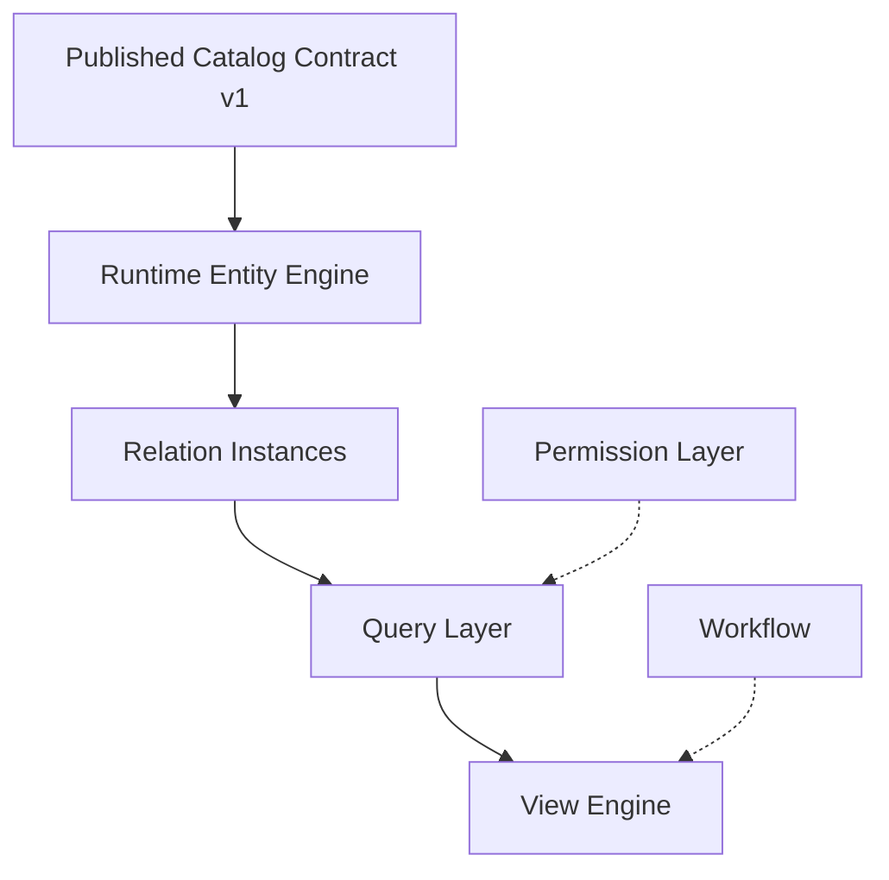

# ЯсноПро — Runtime Foundation Plan

**Status:** active (post Slice 1 P1 stabilization)  
**Scope:** Slice 2 preparation — **не** реализация Entity Engine в этом документе

---

## 1. Цель Runtime Foundation

Построить исполняемый слой платформы, который:

- работает **только** на published metadata (Published Catalog Contract v1);
- хранит и изменяет **бизнес-данные** (entity values, relation instances);
- остаётся изолированным от Designer draft и legacy Universal Table как source of truth.

Designer отвечает за конфигурацию; Runtime — за исполнение опубликованной модели.

---

## 2. Runtime vs Designer

| Аспект | Designer | Runtime |
|--------|----------|---------|
| Данные | Draft metadata tables | Published snapshots + entity tables |
| API prefix | `/designer/...` | `/runtime/...` |
| Auth (Slice 1) | `require_designer_user` + `require_tenant` | Catalog: `require_tenant` only (см. §9) |
| Мутации metadata | CRUD + publish | Нет (metadata read-only) |
| Мутации данных | Нет | Entity CRUD (Slice 2+) |

---

## 3. Runtime Catalog (Slice 1 — готово)

- **Read API:** `GET /runtime/platform-metadata/tenants/{tenant_id}/catalog`
- **Version API:** `GET .../catalog/version`
- Источник: `designer_metadata_snapshots` (последний по `catalog_version`)
- Контракт: [PUBLISHED_CATALOG_SCHEMA_v1.md](./PUBLISHED_CATALOG_SCHEMA_v1.md)

---

## 4. Runtime Entity Engine (Slice 2)

Ядро CRUD для экземпляров object types:

- валидация полей по published field definitions;
- tenant isolation;
- версионирование записей (по плану Slice 2);
- **не** читает draft designer tables.

---

## 5. Runtime Entity Values

Таблицы/модели значений полей (EAV или typed columns — решение Slice 2). Связь:

- `object_type_key` / `object_type_id` из catalog
- значения соответствуют `field_type` из snapshot

---

## 6. Runtime Relation Instances

Экземпляры связей между entity records по `relations[]` из catalog. Зависит от Entity Engine (сначала сущности, потом links).

### Active Graph Semantics

Ребро relation считается **активным** только если одновременно:

1. relation instance активен (`runtime_relation_instances.deleted_at IS NULL`);
2. source node активен (`runtime_entities.deleted_at IS NULL`);
3. target node активен (`runtime_entities.deleted_at IS NULL`).

Это правило применяется ко всем runtime read/list graph endpoints.  
При этом relation instances физически не удаляются и soft-delete cascade не используется.

---

## 7. Runtime Query Layer

Фильтрация, сортировка, пагинация списков entity без View Engine UI. Использует catalog для допустимых полей и типов.

---

## 8. Runtime View Engine

Интерпретация `views[].layout_json` / `filters_json` поверх Query Layer. **После** Entity + Query — не раньше.

---

## 9. Permission Layer (будущее)

Row-level / object-type ACL, роли runtime. Не в Slice 2 MVP. Catalog auth см. ниже.

---

## 10. Workflow / Automation (будущее)

BPMN, триггеры, scheduled jobs — вне Slice 2. Не блокируют Entity Engine старт при соблюдении запретов ниже.

---

## 11. Slice 2 — что входит

1. Published Catalog Contract — **зафиксирован** (v1 doc)
2. Runtime Entity Engine + storage migrations — **MVP реализован** (`runtime/entities`, migration `20250525_0006`)
3. Relation Instances (базовый) — **MVP реализован** (`runtime/relation_instances`, migration `20250525_0007`)
4. Runtime Query Layer (list/filter MVP)
5. Runtime API routers под `/runtime/...` (отдельно от designer)

---

## 12. Slice 2 — что НЕ входит

- Designer Shell / frontend platform designer
- View Engine (полный UI layout runtime)
- Permission layer
- Workflow / automation
- Переименование `ViewDefinition` → `ViewTemplate`
- Расширение `FieldType` enum / `dependency_counts`
- Legacy Universal Table как SoT
- Изменения migrations `0001`–`0005` без отдельного ADR

---

## 13. Dependency order

1. Published Catalog Contract  
2. Runtime Entity Engine  
3. Relation Instances  
4. Query Layer  
5. View Engine  

Permission и Workflow — параллельно позже, не в критическом пути Slice 2 MVP.

---

## 14. Запреты (hard rules)

1. **Не читать** draft metadata tables из Runtime (кроме snapshot/publish audit).
2. **Не использовать** UniversalTable / UniversalView как source of truth для platform entities.
3. **Не смешивать** Designer и Runtime routers в одном модуле без чёткого split.
4. **Не внедрять** workflow, permissions, view engine **раньше** Entity Layer.
5. **Не добавлять** в published snapshot session/UI/entity data (см. catalog schema §12).

---

## 15. Alembic / create_all policy

| Область | Source of truth |
|---------|-----------------|
| Platform designer tables (`designer_*`) | **Alembic** migrations `20250525_0001`–`0005`+ |
| Legacy app tables | `init_db.create_all()` (с исключением platform tables) |

Реализация:

- `PLATFORM_ALEMBIC_TABLE_NAMES` в `shared/constants.py`
- `init_db.py` вызывает `create_all(tables=...)` **без** platform tables
- `alembic/env.py` импортирует platform models для autogenerate/migrate

**Риск:** если БД создана только через старый `create_all` без Alembic — выполнить `alembic upgrade head` или `alembic stamp head` при совпадении схемы.

---

## 16. Runtime Catalog auth policy (Slice 1 decision)

**Решение:** вариант **A** — временно без user auth на catalog endpoints.

- Применяется `require_tenant` (portal exists).
- **TODO(P2):** `require_runtime_catalog_access` — когда появится безопасная зависимость (tenant membership + role), без дублирования designer roles.
- Новую ad-hoc auth dependency **не** добавлять в P1.

Файл: `backend/app/modules/platform/runtime/catalog/router.py`

---

## 17. Designer auth (Slice 1 P1)

Все endpoints под `/designer/tenants/{tenant_id}/...`:

- `Depends(require_tenant)` + `Depends(require_designer_user)` на `tenant_router`
- мутации передают `current_user: User` в service layer

Роли: `DESIGNER_ROLES` в `shared/constants.py`.

---

## 18. Готовность к Entity Engine

После P1 stabilization:

| Критерий | Статус |
|----------|--------|
| Designer write auth | восстановлен |
| Published catalog contract doc | да |
| Runtime foundation plan | да |
| Alembic policy documented + create_all exclusion | да |
| Runtime catalog auth decision | TODO P2, задокументировано |

**Можно начинать Runtime Entity Engine** при условии: команда принимает catalog read без user auth до P2; entity migrations — новая цепочка Alembic, не трогая 0001–0005.
